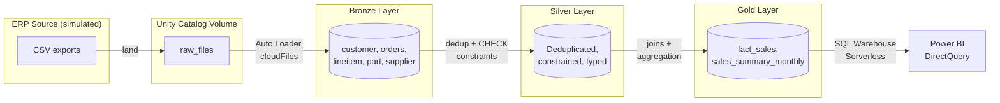

# ERP Lakehouse Migration

An end-to-end data lakehouse pipeline built on **Databricks**, simulating a real-world ERP migration scenario — from incremental ingestion to a governed, query-optimized analytics layer connected to Power BI.

Built as a hands-on portfolio project to demonstrate production-grade patterns: Auto Loader ingestion, Unity Catalog governance, data quality constraints, performance optimization, and CI/CD via Databricks Asset Bundles + GitHub Actions.

## Architecture



**Medallion architecture** (Bronze → Silver → Gold) on **Delta Lake**, governed end-to-end by **Unity Catalog**.

## Tech stack

| Layer | Technology |
|---|---|
| Ingestion | Auto Loader (`cloudFiles`), incremental batch via `trigger(availableNow=True)` |
| Storage & governance | Delta Lake, Unity Catalog (Catalogs, Schemas, Volumes) |
| Compute | Databricks Serverless Compute |
| Data quality | Delta CHECK constraints, window-function deduplication |
| Performance | Partitioning (year/month) + Z-ORDER |
| Orchestration & CI/CD | Databricks Asset Bundles + GitHub Actions |
| BI | Power BI (DirectQuery via Serverless SQL Warehouse) |
| Cloud | AWS |

## Pipeline

1. **Landing**: CSV files simulating ERP exports land in a Unity Catalog Volume, sampled from `samples.tpch` while preserving referential integrity (orders as anchor, related tables joined to maintain FK consistency).
2. **Bronze** (`01_bronze_ingest`): Auto Loader ingests incrementally with schema inference and evolution. Audit columns (`_ingested_at`, `_source_file`) track lineage.
3. **Silver** (`03_silver_transform`): Deduplication by business key using window functions, CHECK constraints enforcing data quality at the platform level, idempotent constraint creation.
4. **Gold** (`04_gold_aggregate`): Star-schema-style fact table (`fact_sales`) and a pre-aggregated summary table (`sales_summary_monthly`), partitioned by year/month and Z-ordered on high-cardinality filter columns.
5. **Consumption**: Power BI connects via DirectQuery through a Serverless SQL Warehouse.

## CI/CD

```
push to main → GitHub Actions → databricks bundle deploy → Job created/updated in Databricks
```

Defined declaratively in `databricks.yml` (Databricks Asset Bundles) and triggered by `.github/workflows/deploy.yml`. Credentials are stored as encrypted GitHub Secrets, never hardcoded.

## Key engineering decisions

- **`trigger(availableNow=True)`** instead of always-on streaming: processes everything available and stops — incremental batch semantics using the Structured Streaming API, avoiding idle compute costs.
- **`_metadata.file_path`** instead of the legacy `input_file_name()`: required by Unity Catalog governance, avoids exposing raw storage paths outside access control.
- **Referential-integrity-aware sampling**: independently sampling related tables breaks foreign keys; sampling must propagate from an anchor table through joins.
- **Idempotent constraint creation**: wrapped in `try/except`, catching only the expected "already exists" error and re-raising anything else — safe to re-run the full pipeline without manual cleanup.
- **Serverless compute over classic clusters**: this workspace only supports serverless jobs — removed explicit cluster definitions from the bundle and let Databricks manage compute automatically.

## Troubleshooting log

Real errors hit and resolved while building this project:

| Issue | Root cause | Fix |
|---|---|---|
| `UC_VOLUME_NOT_FOUND` | Checkpoint/schema paths pointed to volumes that didn't exist yet | Created a dedicated `pipeline_metadata` volume, separate from data volumes |
| `input_file_name not supported` | Legacy function incompatible with Unity Catalog governance | Switched to `_metadata.file_path` |
| Joins returning 0 rows | Independently sampling related tables broke foreign key relationships | Re-sampled from an anchor table, propagating via joins |
| `DELTA_CONSTRAINT_ALREADY_EXISTS` | Re-running the notebook tried to re-add an existing constraint | Wrapped constraint creation in `try/except`, idempotent by design |
| `cannot configure default credentials` | GitHub Secrets were missing from the repository | Created `DATABRICKS_HOST` / `DATABRICKS_TOKEN` as repository secrets |
| `Only serverless compute is supported` | Bundle defined a classic `job_cluster`, unsupported in this workspace | Removed cluster definition, defaulted to serverless |

## Repository structure

```
databricks_portfolio/
├── databricks.yml
├── .github/workflows/deploy.yml
├── notebooks/
│   ├── 00_setup_volume.ipynb
│   ├── 01_bronze_ingest.ipynb
│   ├── 02_validate_bronze.ipynb
│   ├── 03_silver_transform.ipynb
│   └── 04_gold_aggregate.ipynb
└── README.md
```
